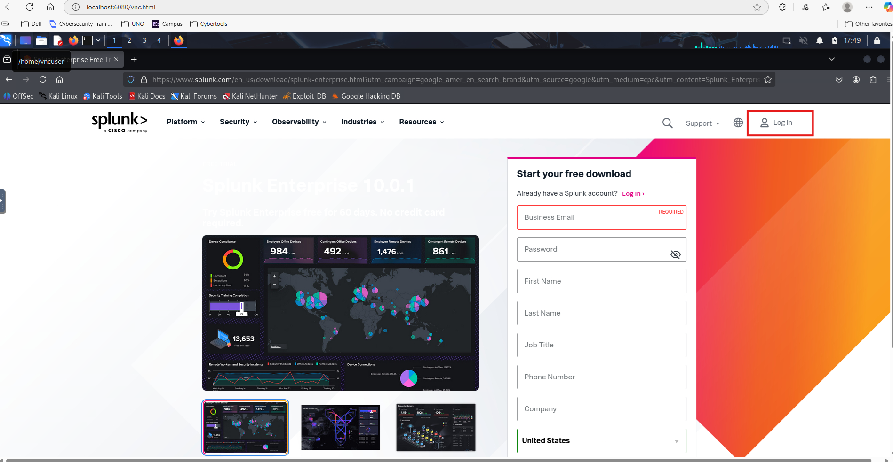
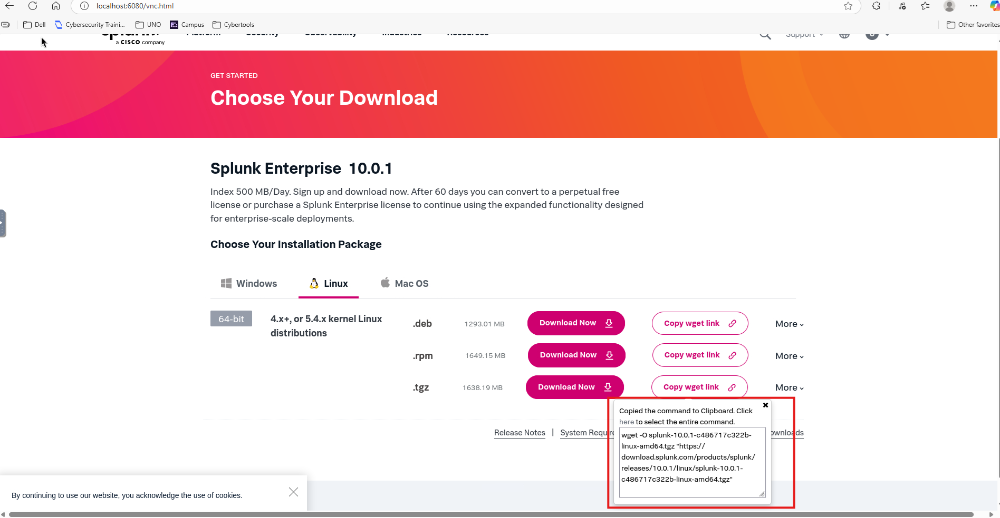
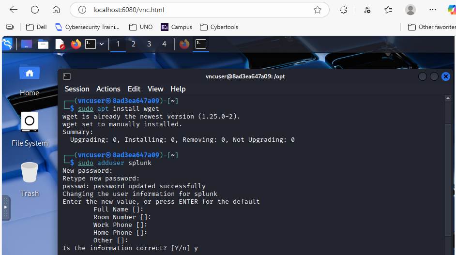
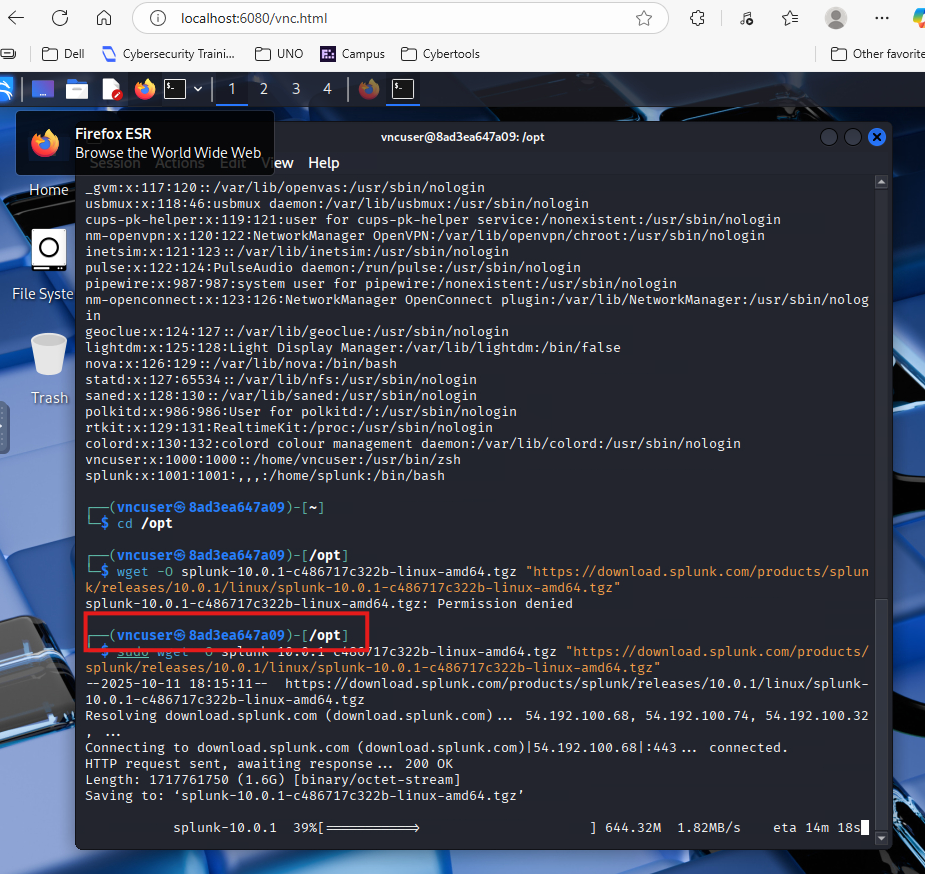

# Learning how to to install splunk

1. Create a splunk account or just log in (splunk.com) if you already have an account
   
   
   
2. Click on `Free Splunk` on top right, click on `Download Free 60-day-Trial` under `Splunk Enterprise` and copy the wget link under `Linux .tgz`   installation package.
   
   
   
3. Open the terminal icon above to open a terminal and run the following commands:
   
   1. `sudo apt install wget` to install the wget package
   2. `sudo adduser splunk` to create a new user since we don't want to install splunk as a root user (splunk does not recommend).
      
      
      
   3. `cd /opt` to move to the /opt directory to install the .tar file inside this directory
   4. once inside /opt directory, run `sudo <wget link here>` to install the package in here.
      
      
      
   5.
