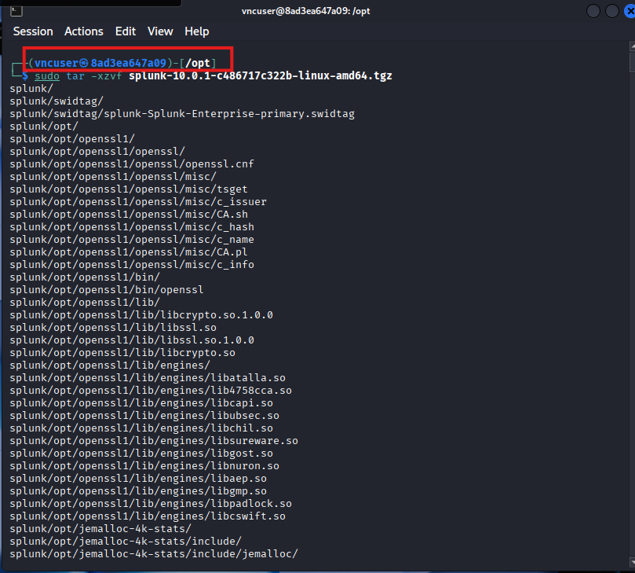
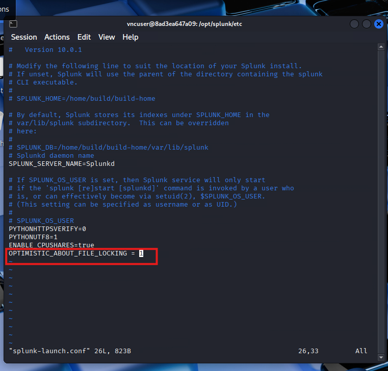
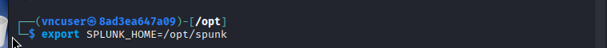
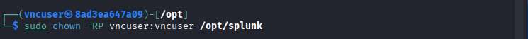
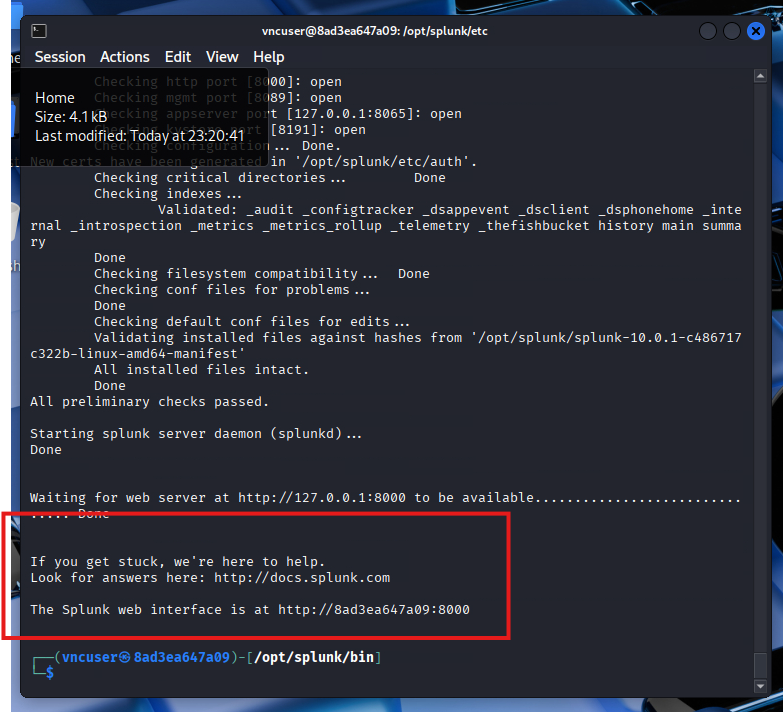
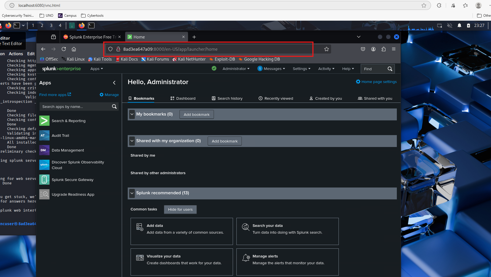

# Learning how to to install splunk

1. Create a splunk account or just log in (splunk.com) if you already have an account

   
2. Click on `Free Splunk` on top right, click on `Download Free 60-day-Trial` under `Splunk Enterprise` and copy the wget link under `Linux .tgz`   installation package.

   
3. Open the terminal icon above to open a terminal and run the following commands:

   1. `sudo apt install wget` to install the wget package

   2. `cd /opt` to move to the /opt directory to install the .tar file inside this directory
   3. once inside /opt directory, run `sudo <wget link here>` to install the package in here.

      
   4. once the tar file installation is done, run `sudo tar -xzvf <splunk tgz file here>` to extract the splunk files inside /opt directory. Should see something like this:

      
   5. change directory `cd /opt/splunk/etc` and run `sudo vi splunk-launch.conf` to open a text editor and append the following line at the end of the file `OPTIMISTIC_ABOUT_FILE_LOCKING = 1`. Note: Once inside the file in vi text editor press `i` to be allowed to insert text and then use the arrows to go to the bottom of the file and type the line describe above. Once done typing, press `ESC`, then `:wq` to save and exit.

      
   6. run `export SPLUNK_HOME=/opt/splunk` to set environement varaibles

      
   7. ensure all files and directories are owned by vncuser `chown -RP vncuser:vncuser /opt/splunk`

      
   8. change directory `cd/opt/splunk/bin` and run `sudo ./splunk start` to start the splunk server.
   9. Read through the text, press `Enter` or `spacebar` to scroll down and when view is 100% done press  `y` to agree with license.
   10. Enter an admin username you want and a password to create your splunk server account.
   11. If you did everything correct, you should see the url where the splunk web interface will be available. Go to that url and input the username and password you chose above.

       

       

       ### Congratulations! You know how to install splunk now
